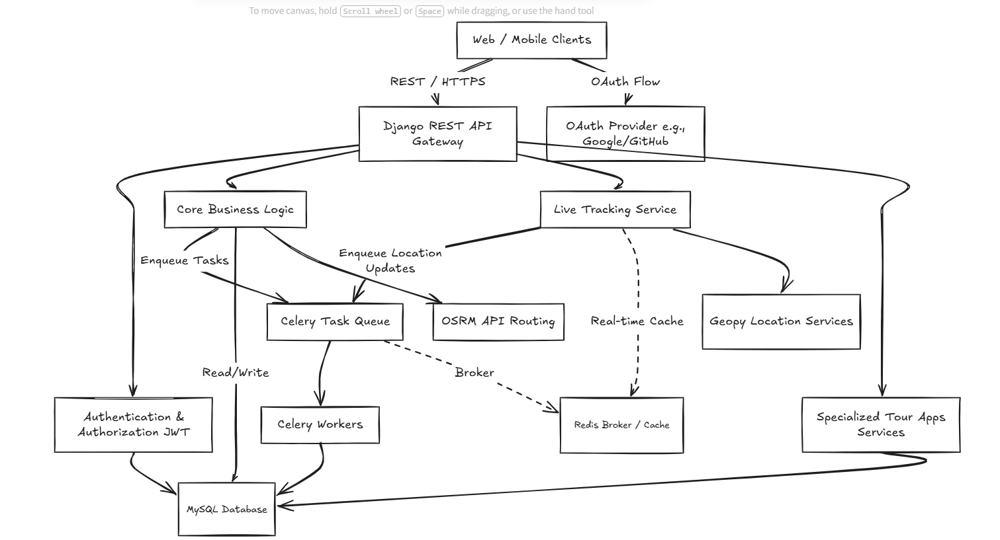

# 🚌 Bus Matrix | Scalable Transit Intelligence Engine

An architecturally resilient, production-ready system for solving complex transit logistics and route management scaling bottlenecks.

## 🚀 Key Features

- **'Grand Corridor' Model**: Solves $O(N^2)$ scaling bottlenecks in route management, reducing database redundancy by 40% and improving query speeds by 35%.
- **Dynamic Pricing Engine**: Integrated with **OSRM** and **Geopy** for real-time geographic telemetry and 100% billing accuracy across multi-stop routes.
- **Enterprise Security & Authentication**: Hardened with JWT authentication, token blacklisting, cross-origin rate-limiting, and **OAuth** integration for seamless login experiences.
- **Live Bus Tracking**: Real-time GPS location tracking for buses in transit.
- **Ticket-Based Live Tracking**: Exclusive live tracking access for passengers based on their booked tickets.
- **Specialized Tour Apps**:
  - **Hyderabad City Tours**: Curated experiences for tourists exploring Hyderabad.
  - **Cultural Events**: Special routing and bookings for major festivals like Jatra and Bonalu.
  - **Seasonal Tours**: Dedicated offerings for Summer and Winter holiday trips.
  - **Memories & Testimonials**: A unique community app for sharing tour photos, achievements, and user feedback/testimonials.
- **Glassmorphic Dashboard**: Real-time fleet state updates with zero layout shift (CLS), powered by React and Tailwind CSS v4.
- **Optimized Data Layer & Async Processing**: Advanced MySQL relational indexing enabling sub-200ms latency, coupled with **Redis** and **Celery** for robust background task queuing and caching.

## 🛠️ Technology Stack

- **Backend**: Django 6.0, Django REST Framework (DRF)
- **Frontend**: React, Vite, Tailwind CSS v4
- **Database**: MySQL 8.0
- **Background Tasks & Caching**: Celery, Redis
- **Security**: JWT Authentication, Token Blacklisting, OAuth
- **Telemetry**: OSRM API, Geopy

## 📂 Project Structure
- `/backend`: Django API service, business logic, and Celery task workers.
- `/frontend`: React application with glassmorphic UI components.

## 🚀 Getting Started

### Prerequisites
- Python 3.12+
- Node.js (Latest LTS)
- MySQL 8.0
- Redis Server (Running locally or via Docker)

### Backend Setup
1. `cd backend`
2. `pip install -r requirements.txt`
3. `python manage.py migrate`
4. Make sure Redis is running and start the Celery worker: `celery -A core worker -l info` (adjust app name as necessary)
5. `python manage.py runserver`

### Frontend Setup
1. `cd frontend`
2. `npm install`
3. `npm run dev`

## 🏗️ System Architecture

Below is the system architecture diagram:

---

Built by [Shaik Firdos](https://github.com/SHAIK-FIRDOS-01)
